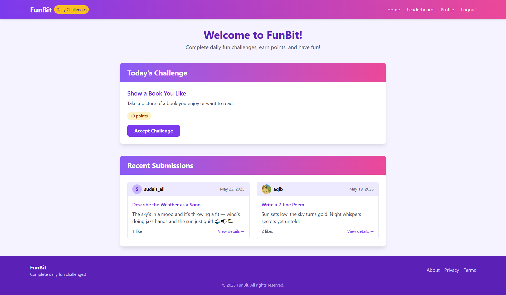

# 🎉 FunBit

**FunBit** is a playful web app where users complete daily challenges, earn points, and have fun by sharing creative submissions. From taking quirky selfies to writing short poems, FunBit brings joy and engagement to your daily routine!



---

## 🚀 Features

* ✨ **Daily Challenge:** A new fun activity every day!

* 🖼️ **Image/Text Submissions:** Some challenges require a photo, others a written response.

* 🔥 **Live Leaderboard:** Track user activity and top participants.

* 💬 **Likes & Comments:** Engage with other users’ submissions.

* 🧾 **User Accounts:** Log in, sign up, and manage your challenge participation.

* 🌈 **Colorful UI:** Bright, friendly interface with playful animations.


---

## 📦 Setup Instructions

1. **Clone the repository:**

   ```bash
   git clone https://github.com/aqibcs/funbit-django.git
   cd funbit
   ```

2. **Set up a virtual environment:**

   ```bash
   python -m venv env
   source env/bin/activate  # On Windows: env\Scripts\activate
   ```

3. **Install dependencies:**

   ```bash
   pip install -r requirements.txt
   ```

4. **Run migrations:**

   ```bash
   python manage.py migrate
   ```

5. **(Optional) Populate sample challenges:**

   ```bash
   python populate_challenges.py
   ```

6. **Run the server:**

   ```bash
   python manage.py runserver
   ```

7. Visit `http://127.0.0.1:8000` in your browser.


---

## 👥 Contributing

Pull requests are welcome! For major changes, please open an issue first to discuss what you’d like to change.
